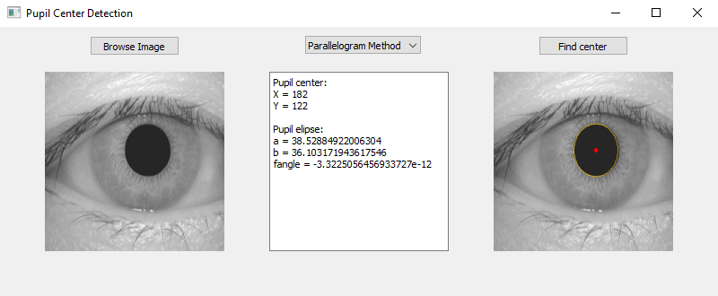

# Pupil_center_detection
 
Simple application pupil center detection using parallelograms mathod [1].

 

[1] Lin, L., Pan, L., Wei, L., & Yu, L. (2010, October). A robust and accurate detection of pupil images. In 2010 3rd international conference on biomedical engineering and informatics (Vol. 1, pp. 70-74). IEEE.
